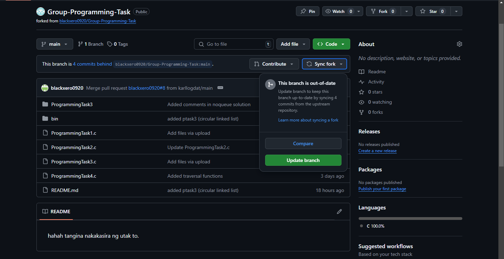

# Programming Task Repository

## Syncing repository
1. Sync Github fork to upstream.


2. Pull fork to local repository using `git pull`.

### Command-line Syncing
### TL;DR
```
# execute once, not every sync
git remote add upstream https://github.com/blckzr/Group-Programming-Task.git 

# execute these everytime you want to sync
git fetch upstream
git merge upstream/main
git push origin main

```
Alternatively, you can use a series of commands in the command line to sync your repository.
1. Add the upstream branch by using the command `git remote add upstream https://github.com/blckzr/Group-Programming-Task.git`. This only needs to be executed once.

2. Get the changes on the upstream branch using `git fetch upstream`.

3. Merge your branch and the newly acquired upstream changes using `git merge upstream/main`.

4. Finally, push the merged branches into your fork using `git push origin main`.

## Uploading changes to upstream

### TL;DR
```
git add -A
git commit -m "{commit message}"
git push
```

1. Add changes to the staging area (files you will commit) using `git add .` or `git add -A`.
2. Commit changes using `git commit -m "{commit message}"`. Make sure your commit messages are descriptive.
3. Push your changes to your fork using `git push`.